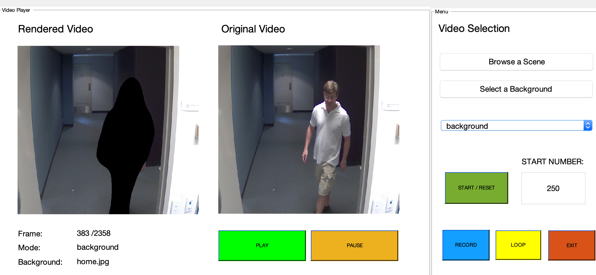

# CV-Challenge-G7

## Project Description

This project is the result of a challenge from the Computer Vision Department of the Chair of Data Processing in the summer semester 2020. The motivation is based on the fact that in today's pandemic time more and more video calls and conferences take place in the own four walls. At the same time, you want to protect your own privacy from the eyes of others. This year's Challenge, therefore, deals with the distinction between foreground and background, as well as the possibility of replacing unwanted scene components. 

The data for this challenge is the ChokePoint dataset, which consists of recordings from surveillance cameras at various portals (P1, P2). There are three cameras each (C1, C2, C3), which film the same scenes (S1 - S5) simultaneously. Each portal was also recorded once from the inside (E enter) and once from the outside (L leave). The resulting images have a size of 800×600 pixels and were taken at 30fps.

__Link:__ http://arma.sourceforge.net/chokepoint/


## Challenge Requirements

* The group has to implement a ImageReader class, which is able to play two of the three video streams from a scene folder as an endless loop.
* The group has to implement a way to load images. In order to load an appropriate amount of images from the camera folders, the class should provide the method .next().
* The group has to implement a function segmentation(left, right) which uses the two previously created tensors left and right with successive image pairs to estimate foreground and background for the first image pair.
* The group has to implement a function render(frame, mask, bg, render mode), which can process the current image of the left camera frame using the corresponding segmentation mask mask. 

* The parameter render mode selects between the following modes: 

   1) foreground: The background is set to black. The foreground in the image should be as little as can be changed.
   2) background: The foreground is set to black and only the background is visible.
   3) overlay: Foreground and background are set to black with good distinguishable colours are dyed transparent.
   4= substitute: Replaces the background with a virtual background which is passed in bg. 
   The virtual background bg is an RGB image with any size N × M × 3.

* The group has to complete the config.m file. This file is always called before challenge.m and fills the workspace with all necessary variables, settings and paths. 
* The group has to implement challenge.m whcih executes the previously implemented functions in a loop until the selected scene folder is exhausted. In addition, the group has measure the time the program needs to execute the task and store the value in the variable elapsed time.
* Finally, the group has to implement a Graphical User Interface which is able to:

   1) Select any scene folder path,
   2) A file path for a virtual background select,
   3) Selection of the starting point (see variable start),
   4) Selection of the rendering mode (see Variable mode),
   5) Display of the stereo inputs and the selected output stream,
   6) Playback control: Start, Stop, Loop (endless playback),
   7) Saving the rendered movie under any file path.

The GUI should be opened with the command start gui and may work independently of challenge.m or config.m.

## Usage Instructions
### Standalone usage using challenge.m (suitable for command line run)
- Run challenge.m provided in the source code, a video of the segmented video is then saved under/with the destination/name set in config.m.
```matlab
> challenge
```
### GUI usage 
#### How to interact with the GUI
- In order to run the GUI, one can run the GUI.m file in matlab. There will be two windows present. An introduction window which explains the different buttons and their usability and the gui itself.
- In the next step, one can choose a scene folder with the **Browse a Scene** button on the top right. One has to be sure that the scene folder selection have to be according to the prerequisites given in the challenge sheet.
- Now, it is possible to change to mode of replay. This can be done with the popup menu on the right.
- If the user selects the mode “substitute”, a background image of type .jpg has to be chosen. This can be done with the **Select a Background Button**.
- Now, the user can start the replay with the **START / RESET** button. If the “substitute” mode is chosen, and no background image was set, the gui will ask the user to set one first.
- In addition, the user can set a start value, with the **START Number** field. The default value is 0. So the first frame. If the user sets a start value which is bigger then the maximum number of available frames, the default will be set to zero!
- In order to stop or play the video, the user can use the **PLAY** and **STOP** video.
- The user can change the background image and also the modes during replay of the video. 
- If the user wants the replay of the video in infinity mode, he can set the loop condition with the **LOOP** button. When the condition is set, the gui will jump at the last frame back to the start value set.  
- The user can record the streaming of the video with the **RECORD** button. He can finish the recording by pressing the button again. The result will be saved in an output file, named output.avi (30fps). 
- Finally, the user can also exit the gui with the **EXIT** button. A message box will pop up for final confirmation. 


## Application examples
### Segmentation Output from the sequence xxx frame yyyy
 
 <table>
  <tr>
    <td>Missing title (including mode + frame)</td>
     <td>Missing title (including mode + frame)</td>
  </tr>
  <tr>
    <td></td>
    <td></td>
  </tr>
 </table>

 <table>
  <tr>
    <td>Missing title (including mode + frame)</td>
     <td>Missing title (including mode + frame)</td>
  </tr>
  <tr>
    <td></td>
    <td></td>
  </tr>
 </table>
### GUI Interface

<table>
  <tr>
    <td>Opening screen of the gui.</td>
     <td>The gui asks for a background image selection.</td>
  </tr>
  <tr>
    <td></td>
    <td></td>
  </tr>
 </table>
 
 <table>
  <tr>
    <td>Replay of current frame 298 in the substitute mode.</td>
     <td>Replay of current frame 330 in the foreground mode.</td>
  </tr>
  <tr>
    <td></td>
    <td></td>
  </tr>
 </table>
 
 <table>
  <tr>
    <td>Replay of current frame 383 in the background mode.</td>
     <td>Replay of current frame 409 in the overlay mode.</td>
  </tr>
  <tr>
    <td></td>
    <td></td>
  </tr>
 </table> 
 
## Packages included and Matlab version

- Tested on Matlab 2020a
- Image Processing Toolbox (Add-on on Matlab platform)

## References
- Y. Wong, S. Chen, S. Mau, C. Sanderson, B.C. Lovell
Patch-based Probabilistic Image Quality Assessment for Face Selection and Improved Video-based Face Recognition
IEEE Biometrics Workshop, Computer Vision and Pattern Recognition (CVPR) Workshops, pages 81-88. IEEE, June 2011.
- Chokepoint Dataset (http://arma.sourceforge.net/chokepoint)


